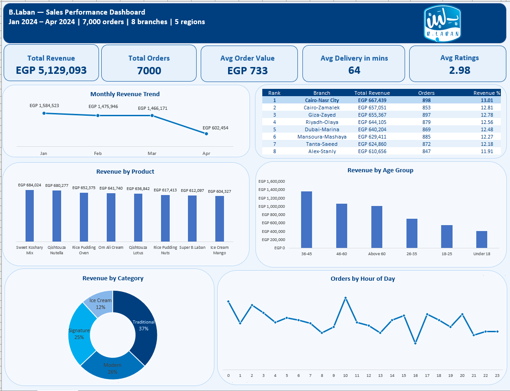

# 🥛 High Calorie Data — B.Laban Sales Analysis

> *Cleaning, analysing, and visualising 7,000 orders from one of Egypt's most beloved dessert chains.*



---

## 📌 Project Overview

B.Laban is an Egyptian dessert chain operating across 8 branches in 5 regions including Greater Cairo, Alexandria, Delta, KSA, and UAE. This project performs a full end-to-end data analysis on 7,000 sales transactions from January to April 2024 — covering everything from raw data cleaning in SQL Server to an interactive Excel dashboard.

---

## 🛠️ Tools Used

| Tool | Purpose |
|---|---|
| SQL Server (SSMS) | Data exploration, cleaning, and analysis |
| Excel 2016 + Power Query | Data modelling and interactive dashboard |

---

## 📂 Project Structure

```
blaban-sales-analysis/
├── README.md
├── data/
│   └── blaban_train.csv
├── sql/
│   ├── phase1_exploration.sql
│   ├── phase2_cleaning.sql
│   └── phase3_analysis.sql
├── excel/
│   └── blaban_dashboard.xlsx
└── assets/
    └── dashboard_preview.png
```

---

## 🔄 Project Phases

### Phase 1 — Exploration
- Audited 7,000 rows across 28 columns
- Identified data types, distinct values, null counts, and date range
- Discovered `Quantity` stored as `nvarchar` instead of `INT`

### Phase 2 — Cleaning
- Fixed `Quantity` data type from `nvarchar` → `INT`
- Filled ~820–858 nulls per column across 5 columns using logical imputation:
  - `Topping_Type` → `'No Topping'`
  - `Membership_Status` → `'Non-Member'`
  - `Customer_Gender` → `'Unknown'`
  - `Customer_Age` and `Store_Rating` → column average
- Fixed outliers: `Customer_Age = 280` and `Unit_Price = 9999.99`
- Corrected negative `Quantity` values using `ABS()`
- Recalculated `Total_Sales` from formula for all rows to ensure financial consistency

### Phase 3 — Analysis
Extracted insights across 4 themes:
- **Revenue** — by branch, region, product, category, discount tier, and monthly trend
- **Customers** — by membership, gender, age group, and payment method
- **Operations** — peak hours, weekend vs weekday, delivery performance, store ratings
- **External Factors** — public holidays, temperature bands, humidity bands

### Phase 4 & 5 — Excel Dashboard
- Connected Excel to SQL Server via Power Query — 12 queries loaded simultaneously
- Built an interactive dashboard with B.Laban brand colors
- 5 KPI cards, 1 ranked table, 4 column/line charts, 1 donut chart

---

## 📊 Key Findings

- 💰 **EGP 5.1M** total revenue across 7,000 orders — avg order value **EGP 733**
- 📉 **Declining revenue trend** — Jan (EGP 1.58M) dropped to Apr (EGP 602K, partial month)
- 🏪 **Cairo-Nasr City** leads revenue at 13% but all 8 branches are within 1% of each other — remarkably even distribution
- 🍚 **Traditional category dominates** at 37% of revenue — Sweet Koshary Mix is the #1 product
- 🕛 **Midnight orders have the highest avg value** (EGP 781) — late night customers spend more
- 👥 **Non-Members are the largest customer segment** — a major loyalty program growth opportunity
- ⭐ **All branches rated below 3.1/5** — a chain-wide service quality issue
- 💸 **Discounts hurt revenue** — orders with >10% discount average EGP 637 vs EGP 752 with no discount
- 🌡️ **Hot + humid weather drives higher spend** — avg order value peaks in high humidity conditions

---

## 📈 Dashboard Preview

The dashboard includes:
- **KPI Cards** — Total Revenue, Total Orders, Avg Order Value, Avg Delivery Time, Avg Rating
- **Monthly Revenue Trend** — Line chart showing Jan–Apr trajectory
- **Branch Performance Table** — Ranked by revenue with orders and revenue share
- **Revenue by Product** — Column chart comparing all 8 products
- **Revenue by Age Group** — Column chart showing 36–45 as top spenders
- **Revenue by Category** — Donut chart with Traditional leading at 37%
- **Orders by Hour of Day** — Line chart revealing peak ordering times

---

## 💡 How to Use

1. Clone or download the repository
2. Open `blaban_dashboard.xlsx` in Excel 2016 or later
3. The Dashboard sheet opens by default
4. To refresh data: `Data` → `Refresh All` (requires SQL Server connection)

---

## 👤 Author

**Mohamed Esam Ragab**  
Aspiring Data Analyst  
[LinkedIn](linkedin.com/in/mohamed-esam) · [GitHub](https://github.com/mo-esam12)

---

*This project was built as part of my data analytics portfolio to demonstrate end-to-end skills in SQL data cleaning, exploratory analysis, and Excel dashboard design.*
